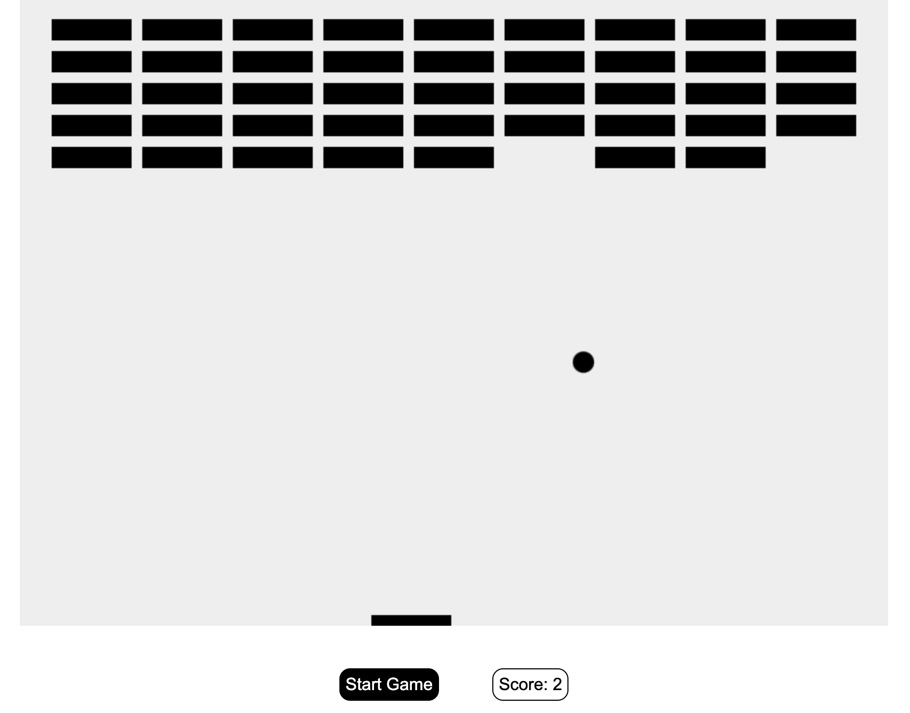

# Canvas Breakout Game

## Project Snapshots

## Description

This game allows users to play the 2D Breakout game in the browser, increasing the score and increasing the speed of the ball after each collision detected.

## Tech Stack

- HTML5
- CSS
- Canvas
- JavaScript

## Deployment

Feel free to view the completed game by clicking the [link here.](https://brogers111.github.io/canvas-breakout-game/)

## Future Improvements

- Improve design (change colors of ball/paddle/bricks)
- Store high-score
- Add 3 lives maintaining removed brick consistency
